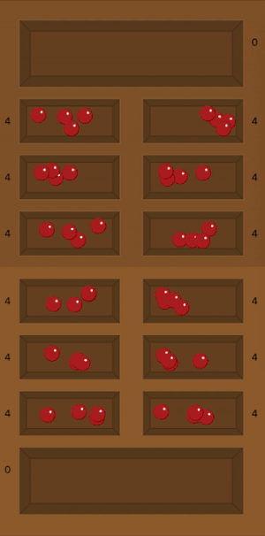
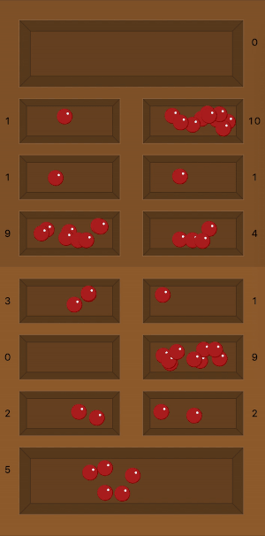

# Twisted Mancala

This python application allows users to play a game of Twisted Mancala (with different rules from the original game, but the same board) with a Minimax AI. The user can pick the move from the terminal and see the board visually on a separate window.


## Table of Contents

1. [Getting Started](#getting-started)
   1. [Installing Dependencies](#installing-dependencies)
   1. [Development Environment](#development-environment)
1. [Gameplay](#gameplay)
   1. [Rules](#rules)
   1. [Demonstration](#demonstration)
1. [Styling](#styling)
1. [License](#license)

## Getting Started

### Installing Dependencies

This project utilizes only the Python Standard Library.

### Development Environment

To start up the application, from within the root directory:

```sh
python3 src/mancala.py
```

## Gameplay

### Rules

This game shares the same board and number of pebbles as mancala, but the rules are slightly different.

1. When the player chooses a pit, the player picks up all of the pebbles in the chosen pit and drops one pebble into the next pits, excluding the opponent's store. The order of the pits go from pit 0 to pit 12, 0 being the player 1's store and going counter clockwise on the board (pit 12 is the pit before player 1's store).
1. When the player runs out of the pebbles in hand, the player can pick up the pebbles from the last pit the last pebble was dropped into.
1. Step 2 repeats until the last pit the player dropped the pebble into did not contain any pebbles. If the player drops the last pebble into an empty pit, the player's turn ends.
1. Player 1 and 2 alternate turns until none of the pebbles are available in the pits.
1. Whoever has more pebbles in ther store is the winner of the game.

### Demonstration

Once the application is launched through the terminal, the player can see the board as shown below.


The player will control the moves through the terminal. The shell will print,

```sh
###########################
# ~ Let's play Mancala! ~ #
###########################

-----It is player 0's turn.-----
Pick a pit number [0, 1, 2, 10, 11, 12] to sow pebbles:
```

When the player inputs the move, the pebbles in the board will start to move.




## Styling

Twisted Mancala uses the [PEP 8 -- Style Guide for Python Code](https://www.python.org/dev/peps/pep-0008/).

## License

Twisted Mancala uses the [MIT License](LICENSE.md).
